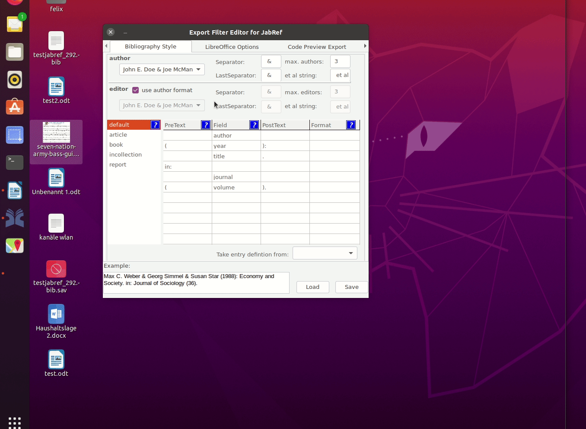

# Export-Filter-Editor

What's new
====================
Version 0.4 (beta)
- new preview for open office definitions
- new code for preview window [under the hood]
- new option to separate name and year for in-text citations in open office
- new option to separate pages with a big-hiven

Export Filter Editor 
================
Version 0.4 (beta)
This editor is free software under Conditions of  GNU General Public License.
Compiled using: Lazarus 1.6 & Richmemo 1.0

- Developer: Felix Wilke (felixw83@gmail.com)
- developed with: Lazarus
- icon based on: http://commons.wikimedia.org/wiki/File:JabRef_Icon.svg

How to Use
=======
- Fill the table according to your wishes.
- Save as HTML,RTF, JSTYLE File or as FDAT for later usage
- Use filter in Jabref:
  For RTF and HTML: Options->manage custom exports
  For JSTYLE: Tools-> OpenOffice connection->Select Style

FAQ
=======
How to run the software under Linux?
  - The program is a binary file. To run it, you can just double click on it.
  - to run it from terminal: "./Export-Filter_Editor_Linux_64bit_v04b"
    (May be it necessary to mark it as executable first)

The Export-Filter-Editor does not support the Author format needed.
  - This editor tries to cover the most common features.
  - For more options have a look at the JabRef documentation.
    and modify your Export-Filter afterwards with an external editor.
      see: http://help.jabref.org/en/CustomExports
      and: http://help.jabref.org/en/OpenOfficeIntegration

I experience some coding issues, some characters are not encoded correctly.
  - This program uses UTF-8 encoding
  - If you experience issues try to change the encoding 
    by using external editors like
    - Notepad++ in Windows or Gedit on Linux

Translation
=======
You can load a specific language file for the editor. 
Put translation.ini file into the Folder of the application
Currently there is an uncompleted German translation file
Feel free to create and distribute other translations.
Source: README.txt, updated 2020-11-24 
